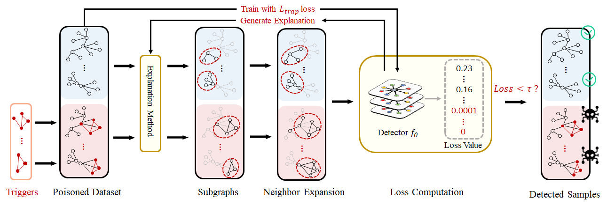

# XGBD: Explanation-Guided Backdoor Detection on Graphs

## Introduction
XGBD is an e**X**planation-**G**uided **B**ackdoor **D**etection method on graph data. It could detect whether there are backdoor samples in the graph dataset. Our empirical experiments show that XGBD could achieve over 90% accuracy in detection across all the datasets.

## Quick Start
### XGBD with SubgraphX

```shell
python attack.py --log_screen True --data_path . --model GIN --dataset MUTAG --lr 0.01 --log_screen True --batch_size 64 --num_hidden 128 --num_classes 2 --epoch 20 --trigger_size 4 --trigger_density 0.8 --injection_ratio 0.1 --device 0 --explain_method subgraphx --seed 100 --attack_method subgraph --gamma 0.5
```
### XGBD with GNNExplainer
```shell
python attack.py --log_screen True --data_path . --model GIN --dataset MUTAG --lr 0.01 --log_screen True --batch_size 64 --num_hidden 128 --num_classes 2 --epoch 20 --trigger_size 4 --trigger_density 0.8 --injection_ratio 0.1 --device 0 --explain_method GNNExplainer --seed 100 --attack_method subgraph --gamma 0.5
```
### XGBD with PGExplainer
```shell
python attack.py --log_screen True --data_path . --model GIN --dataset MUTAG --lr 0.01 --log_screen True --batch_size 64 --num_hidden 128 --num_classes 2 --epoch 20 --trigger_size 4 --trigger_density 0.8 --injection_ratio 0.1 --device 0 --explain_method PGExplainer --seed 100 --attack_method subgraph --gamma 0.5
```

